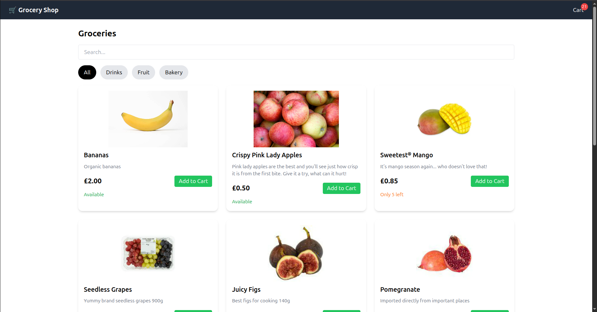
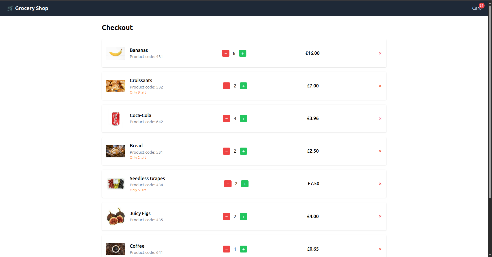
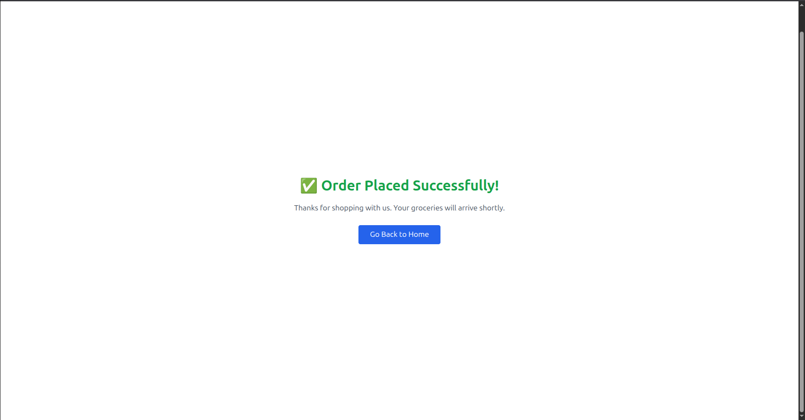

# 🛒 Grocery Shopping Web App

A responsive grocery shopping site with real-time cart, search, checkout, and promotional offers.

## 🚀 Features

- Product filtering by category
- Live search
- Shopping cart with item quantity updates
- Buy 6 Coca-Cola, get 1 free
- Buy 3 Croissants, get 1 Coffee free
- LocalStorage persistence
- Responsive UI (mobile-friendly)

## 🖼️ Screenshots

*Home page*


*Checkout page*


*Success page*


## 🛠️ Tech Stack

- React + TypeScript
- Zustand (state management)
- Tailwind CSS (styling)
- React Router DOM
- Vite (build tool)

## 🧠 How to Run Locally

```bash
git clone https://github.com/ayushsoni02/grocery-shop.git
cd grocery-shop
npm install
npm run dev


📦 API

    Products API:
    https://uxdlyqjm9i.execute-api.eu-west-1.amazonaws.com/s?category=all

✅ Deployment

Deployed on Vercel
💡 Future Improvements

    Payment integration

    Wishlist support

    Admin dashboard